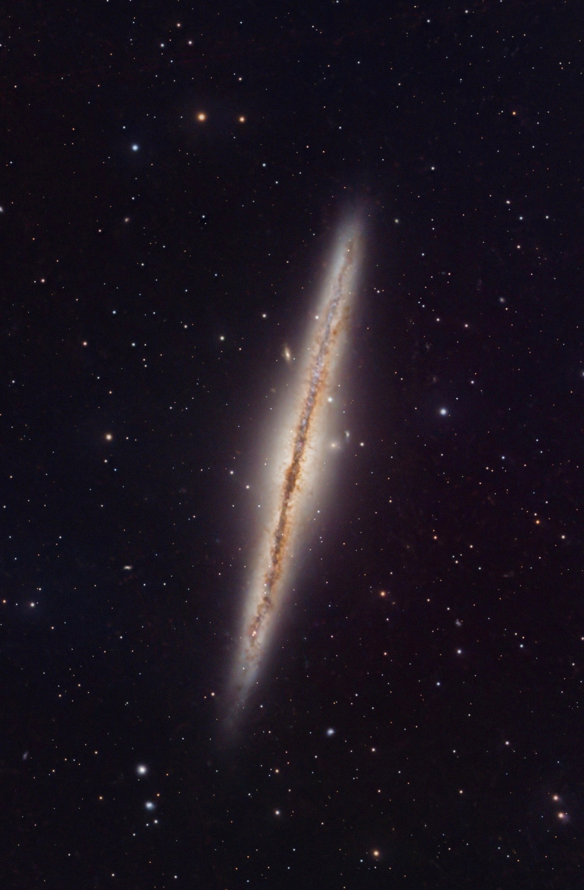

# PixInsight MCP Server

An AI-driven automated deep sky astrophotography processing pipeline for [PixInsight](https://pixinsight.com/). Uses [Claude Code](https://claude.com/claude-code) to drive PixInsight's PJSR scripting engine via a file-based IPC bridge, processing astronomical images through a configurable, branching pipeline with iterative tuning.

## What It Does

You provide integrated master frames (post-WBPP) and a JSON config describing your processing workflow. The pipeline handles everything else — channel combination, gradient removal, color calibration, deconvolution, noise reduction, star separation, stretching, Ha/narrowband injection, luminance processing, local contrast enhancement, and star recombination.

```
You: "Process NGC 891 LRGB — edge-on galaxy, 180s subs, Astronomik Deep Sky filters"

Claude Code:
  1. Creates a pipeline config (branches for RGB, stars, luminance)
  2. Runs the full pipeline with intelligent decisions:
     - Compares ABE vs GradientCorrection, picks the most uniform background
     - Creates luminance masks to protect background during LHE/HDRMT
     - Applies screen-blend star recombination (no halos)
  3. Exports preview JPGs at each step for visual review
  4. You review, give feedback, Claude adjusts parameters
  5. Resume from checkpoint — no need to re-run the whole pipeline
```

### Example Result

NGC 891 processed through iterative automated pipeline tuning — from raw integrated masters to final output:

<p align="center">
  
  <br>
  <em>NGC 891 (LRGB) — Processed entirely by the automated pipeline from integrated master frames. Astro ARO, Alentejo Dark Sky Reserve.</em>
</p>

**Pipeline steps**: Channel alignment → RGB combine → Gradient removal (auto ABE/GC) → BXT → Plate solve → SPCC → SCNR → BXT sharpening → NXT → SXT → Star stretch → L processing → Stretch (HT+GHS) → NXT → Curves → LRGB combine → LHE (masked) → HDRMT (masked) → NXT final → Curves → Star addition

## Key Features

### Intelligent Gradient Removal
Automatically compares GradientCorrection vs AutomaticBackgroundExtractor (multiple polynomial degrees), measures background uniformity via corner median sampling, and picks the winner.

### Branching Pipeline
Config-driven branches for parallel processing:
- **Main** (RGB): gradient removal → calibration → stretch → curves → local contrast
- **Stars**: SXT extraction → Seti linear stretch → saturation → screen-blend recombination
- **Luminance**: separate stretch → NXT → BXT → LRGB combine
- **H-alpha** (optional): SXT → stretch → curves → injection into RGB

### Checkpoint & Resume
Auto-saves checkpoints at key stages (SXT, stretch, curves). Resume from any checkpoint after a crash or parameter change — skip hours of reprocessing:
```bash
node scripts/run-pipeline.mjs --config config.json --restart-from curves_main
```

### Memory Management
Automatic undo history purging, image cleanup after merge points, and memory monitoring with configurable thresholds (warn at 4GB, auto-checkpoint and abort at 8GB).

### Luminance Masks
Creates luminance masks from Ha (when available) or the main image to protect background during LHE and HDRMT. Masks are automatically cleaned up after use.

### Preview Export
Exports JPG previews at every pipeline step (with auto-stretch for linear data) for visual review without opening PixInsight.

### Iterative Tuning
Each run generates a detailed markdown report (`iteration_XX.md`) with parameters, memory profile, warnings, and assessment. Feed observations back to Claude Code for the next iteration.

## Architecture

```
Claude Code (conversation + vision)
    |
    |  drives
    |
Pipeline Script (Node.js — scripts/run-pipeline.mjs)
    |
    |  file-based IPC (JSON commands/results)
    |
PixInsight (PJSR watcher script polls for commands)
    |
    +-- MCP Server (TypeScript) — lower-level tool interface
    +-- Web Editor (editor/) — visual config editor
```

## Pipeline Config Format

JSON v2 format with branches and per-step parameters:

```json
{
  "version": 2,
  "name": "NGC891 LRGB",
  "files": {
    "L": "/path/to/master_L.xisf",
    "R": "/path/to/master_R.xisf",
    "G": "/path/to/master_G.xisf",
    "B": "/path/to/master_B.xisf",
    "Ha": "",
    "outputDir": "/path/to/output"
  },
  "branches": {
    "main": { "label": "RGB" },
    "stars": { "label": "Stars", "forkAfter": "sxt" },
    "lum": { "label": "Luminance", "forkAfter": "sxt" }
  },
  "steps": [
    { "id": "combine_rgb", "branch": "main", "enabled": true, "params": {} },
    { "id": "gc", "branch": "main", "enabled": true,
      "params": { "method": "auto", "abePolyDegree": 3, "maxAttempts": 3 } },
    { "id": "nxt_pass1", "branch": "main", "enabled": true,
      "params": { "denoise": 0.25, "detail": 0.15 } },
    ...
  ]
}
```

## Running

```bash
# Prerequisites: Node.js 22+, PixInsight with PJSR watcher running

# Full pipeline
node scripts/run-pipeline.mjs --config path/to/config.json

# Resume from checkpoint
node scripts/run-pipeline.mjs --config path/to/config.json --restart-from stretch

# Start web editor
node editor/server.mjs
```

## Supported Workflows

- **LRGB** — Broadband luminance + color (galaxies, star clusters)
- **HaRGB** — Narrowband Ha + broadband color (emission nebulae)
- **HaLRGB** — Narrowband Ha + luminance + broadband color (full narrowband/broadband blend)

## Processing Techniques

| Technique | Source | Implementation |
|-----------|--------|----------------|
| **Seti Star Stretch** | [Seti Astro](https://www.setiastro.com) (Bill Blanshan) | MTF iterations on linear star residuals via PixelMath |
| **GHS Stretch** | [GHS Script](https://ghsastro.co.uk) (Cranfield & Shelley) | PixelMath piecewise fallback (no .dylib needed) |
| **Non-linear star extraction** | PixInsight community | Identical stretch on pre-SXT checkpoint, then SXT with unscreen |
| **Screen blend recombination** | Standard technique | `~(~$T*~(strength*stars))` — eliminates star halos |
| **Ha 3-part injection** | Community techniques | R-channel injection + luminance boost + detail layer |
| **Intelligent gradient removal** | Original | ABE vs GC comparison via corner uniformity metric |
| **STF Auto-stretch** | PixInsight STF algorithm | `shadows = median - 2.8*MAD`, midtone transfer function |

## Project Structure

```
scripts/run-pipeline.mjs    — Main pipeline script (~2000 lines)
editor/                     — Web UI for pipeline config editing
src/                        — MCP server TypeScript source
pjsr/                       — PixInsight watcher script
.claude/skills/             — Processing knowledge base (PJSR reference, gotchas, techniques)
docs/                       — Architecture, bridge protocol, roadmap
```

## Quick Links

- [Pipeline Skill Reference](.claude/skills/pixinsight-pipeline/SKILL.md)
- [Architecture & Design](docs/architecture.md)
- [Command Bridge Protocol](docs/bridge-protocol.md)
- [MCP Tools Catalog](docs/mcp-tools.md)
- [Implementation Roadmap](docs/roadmap.md)

## Astro ARO — Remote Observatory

This project is developed by a member of [**Astro ARO**](https://astrolentejo.fr), a remote observatory located in the **Alentejo Dark Sky Reserve** (Portugal) — one of Europe's darkest sites at **Bortle 2-3**.

Seats are regularly available for remote observation. Visit the [Teams section](https://astrolentejo.fr/teams) to see images taken from the observatory, and use the [Contact page](https://astrolentejo.fr) if you are interested in joining.

## License

MIT
